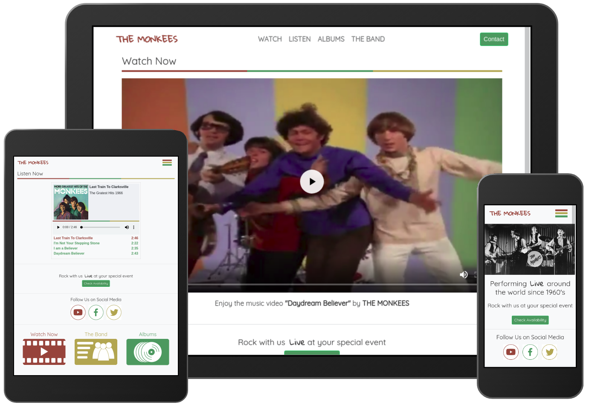

# The Monkees project

The Monkees project is focused on the 1960’s rock band whose goal is to increase business value by engaging with their potential customers via the Internet. Therefore, the project takes shape of a front-end website that highlights features such as media players, availability calendar and gateway to the social media channels. The main purpose of the features in this project is not only to achieve business goals but also to satisfy user needs, hence to ensure positive user experience (UX).
# UX
In order to build good UX it is necessary to identify business goals and to determine user needs. Therefore, this section gives an insight into the aforementioned aspects, which in turn helps to specify features for this project.
### Business goals:
As specified by the bands representatives during the interviews their business goals are:
* To enable existing and future fans to see and hear their clips.
* To showcase their music albums.
* To create gateway to their social media channels.
* To publicise their availability to perform. 
### User needs:
As a user who is looking for a band for an event, I want to :

* see and hear band’s music clips, so that I could decide whether I like their performance.
* contact someone, so that I could ask questions such as pricing, availability etc.
* see the band’s availability to perform, so that I could immediately know whether the band is available for the required dates.
* know what other people think about the band’s performance.

As a user who has decided to book the band, I want to: 

* contact the band, in order to make an inquiry.
* be able to book the band directly on the website, so I could secure the booking immediately.

As a fan, I want to:

* be able to see and hear the band’s music clips.
* find information about the band, such as biography, existing album releases etc.
* subscribe for the news, so I could get updates on new album releases.
* follow the band on the social media.

   
## Features
This section describes features that satisfy the requirements for the current version release. Also the section briefly outlines additional features for the subsequent versions of this project.
### Existing Features
* **Availability calendar**. Allows users to see the band’s availability to perform. For the ease of access the calendar is embedded in the Bootstrap pop-up dialog. It also contains button that calls out the contact form.
* **Contact form**. Allows users to contact the band by having them fill out three compulsory fields, namely, name, email and message text.  For the ease of access the form is embedded in the Bootstrap pop-up dialog.
* **Audio player**. The player makes use of HTML audio tag to enable user play audio files. It also uses iFrame tag to simulate play-list functionality (allows user to choose a song by clicking the link with a song name without reloading the entire page).
* **Video player.** The player enables users to play the Monkees performance video.
* **Album page.** Provides information about the existing album releases.
* **The Band page.** Provides information about the band.
* **Gateway to the social media.** Contains links to three social media channels namely, Facebook, Youtube and Twitter. Directs users to one of the channels by clicking the suitable icon.
* **Scrolling navigation.** Each page contains icon links to other pages. The main purpose of this feature is to enable alternative access to the different pages for mobile users who prefer scrolling over clicking. 
* **Collapsible navigation bar and grid system.**  Enables cross-devise responsiveness.

### Features left to implement
* **Real-time booking system.**  Should enable users to book the band in real-time, depending on availability.
* **Newsletter subscription system.** Should enable users to subscribe for the newsletter.
## Wireframes 
* [Home page](assets/images/homePage.png)
* [Video page](assets/images/videoPage.png)
* [Audio page](assets/images/audioPage.png)
* [Album page](assets/images/albumPage.png)
* [The Band page](assets/images/bandPage.png)
* [Availability Calendar](assets/images/calendar.png)
* [Contact Form](assets/images/contact.png)
## Technologies used
* **HTML**
* **CSS**
* **JQuery.** Enables Bootstrap functionality.
* **Bootstrap** (4.3.1)
  1. **JavaScript modal plug-in.** Enables the availability calendar and the contact form to be accessed from any part of the site inside the pop up dialog box.
  2. **Collapsible navbar**
  3. **Carousel**
* **Calendar** [(W3Shcools CSS).](https://www.w3schools.com/howto/howto_css_calendar.asp)

## Testing

Current version release has been tested on a variety of different browsers and devices. This section describes each testing process.
#### Contact Form:
- [x] Is accessible from every page on the site and from the availability calendar.
- [x] Error message appears on the attempt to submit empty fields.
- [x] Error message appears on the attempt to submit invalid email address.
- [x] Feedback is shown on successful submission.
#### Broken inks:
- [x] No broken links found. Testing was done manually and also automatically with [deadlinkchecker](https://www.deadlinkchecker.com) tool. 
- [x] All external links, such us social media, opens in a new browser tab.
#### Media players:
- [x] Video player works as intended.
- [ ] Audio player performs well on all browsers, however does not work as intended on Safari (see [“Bugs”](#Bugs) section bellow).
#### Responsiveness:
- [x] The website adjusts to different screen sizes from 320px wide.
Testing was done with Google Chrome developer tools and manually on different browsers and mobile devices.
##### Browser used:
* Chrome Version 67.0.3396.62
* Cromium Version 76.0.3809.87
* Opera 62
* Firefox 68
* Microsoft Edge 42

##### Mobile devices used:
* iPhone 5 (Safari, Chrome)
* iPad (Safari, Crome)
* Nokia Lumia 830 (Internet Exploler, Chrome)
* Nokia 6.1 (Chrome)
* Samsung Galaxy Note 8 (Chrome)

## Bugs
* **Audio player.** The player is designed by using iFrame tag to simulate play-list functionality. Therefore, when a song name is clicked it should load an appropriate frame and auto-play the song. However, due to Safari policy, auto-play is not allowed by certain browsers. 
## Deployment.

The website is published on github pages at [https://andriusci.github.io/theMonkees/](https://andriusci.github.io/theMonkees/)

#### Deployment procedure.

 From the repository:
1. Go to “Settings”
2. Scroll down to the “Github Pages” section
3. Choose the source form the drop down menu (Master Branch in this case).

## Credits
#### Content
Albums page: 
* Text for “More Greatest Hits of the Monkees“ copied from the Wikipedia article [More Greatest Hits of The Monkees](https://en.wikipedia.org/wiki/More_Greatest_Hits_of_The_Monkees)
* Text for “The Very Best of The Monkees” copied from [Amazon.com](https://www.amazon.com/Very-Best-Monkees/dp/B000IB0CVS)
* Text for the “Greatest Hits” copied from the Wikipedia article [Greatest Hits (1995 the Monkees album)](https://en.wikipedia.org/wiki/Greatest_Hits_(1995_the_Monkees_album)) 

The Band page: 
* Text for “The Band” section copied from the Wikipedia article [The Monkees](https://en.wikipedia.org/wiki/The_Monkees)
* Text about the band members copied from the Wikipedia articles: [Peter Halsten Thorkelson](https://en.wikipedia.org/wiki/Peter_Tork),
                                                                 [Robert Michael Nesmith](https://en.wikipedia.org/wiki/Michael_Nesmith),
                                                                 [George Michael Dolenz](https://en.wikipedia.org/wiki/Micky_Dolenz)and 
                                                                 [Davy Jones](https://en.wikipedia.org/wiki/Davy_Jones_(musician)) copied from the Wikipedia articles
#### Media

Albums page:
* “The Greatest Hits“ album cover obtained from [Amazon.com](https://www.amazon.com/Monkees-Greatest-Hits/dp/B0000033O3/ref=sr_1_fkmr2_1?keywords=Greatest+Hits+%281995+the+Monkees+album%29&qid=1555926547&s=music&sr=8-1-fkmr2)
* “More Greatest Hits of the Monkees “ album cover obained from [www.discogs.com](https://www.discogs.com/The-Monkees-More-Greatest-Hits/release/1039094)

 All other images and media files provided by the Code institute.  

The icons created using [draw.io]() tool.
https://www.draw.io/
